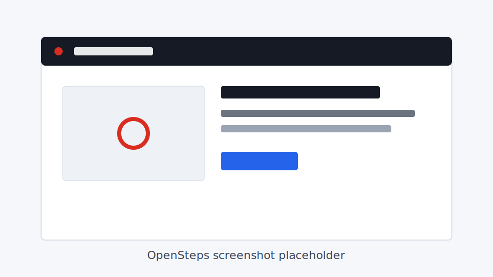

# OpenSteps

OpenSteps is a modern open-source Steps Recorder for Windows. It records desktop workflows and exports clean Markdown guides with screenshots.



## Features

- No cloud, no account, no telemetry, and no uploads.
- Local-first recording with screenshots and click metadata.
- Local saved sessions that can be reopened, renamed, edited, deleted, and exported again.
- Global left-click capture across desktop apps.
- Multi-monitor support that captures only the monitor containing the click by default.
- UI Automation metadata for useful editable step titles.
- Screenshot click highlights.
- Manual screenshot editing with local pixelated redactions and optional red circles before export.
- Editable step list with delete and move controls.
- Markdown export with local `images/step-001.png` assets.

## Why It Exists

Windows Steps Recorder is useful but dated. OpenSteps is built for IT documentation, tutorials, onboarding, and support guides where teams need simple local workflow capture without a SaaS account or browser extension.

## Build And Run

Prerequisites:

- Windows 10 or later.
- .NET 8 SDK with Windows Desktop runtime.

Commands:

```powershell
dotnet build OpenSteps.sln
dotnet test OpenSteps.sln
dotnet run --project src/OpenSteps.App
```

## Privacy

OpenSteps records screenshots, click metadata, and privacy-safe keyboard activity locally. It does not upload anything, does not require an account, and does not include telemetry. The MVP detects that typing happened but does not record actual typed characters by default. Safe actions such as `Enter`, `Tab`, and shortcuts like `Ctrl+S` may be recorded as documentation steps. Password and secure fields are treated cautiously. Screenshots may contain sensitive information, so review captured steps before sharing or exporting.

By default, screenshots are limited to the physical monitor containing the click. Full virtual desktop capture is still available as a legacy/debug mode from the home screen screenshot mode setting.

OpenSteps saves recordings locally as sessions under `%LOCALAPPDATA%\OpenSteps\Sessions`. Each session has its own folder with `session.json` and local screenshots. Users can reopen previous recordings, edit them, rename them, delete them, and export Markdown again. Export copies images into the chosen export folder and uses relative Markdown links; it does not link directly to AppData paths.

Screenshots may contain sensitive data. Before exporting or sharing a guide, review each screenshot and use manual redaction to hide private information. OpenSteps does not upload screenshots and does not automatically detect sensitive information.

## Roadmap

- Better toolbar placement.
- Richer UI Automation captions.
- Additional export formats after the Markdown workflow is solid.

## Contributing

See `AGENTS.md` for repository guidelines. Keep changes focused, add tests for Core behavior, and include manual verification notes for capture or WPF UI changes.
