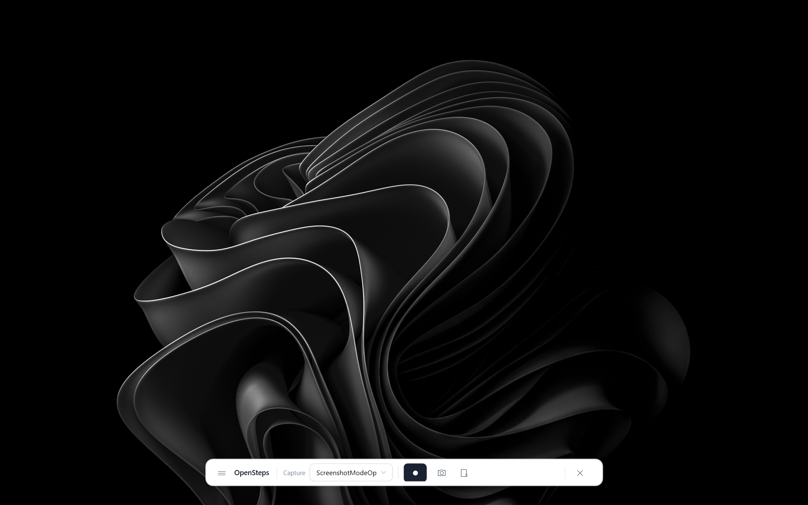
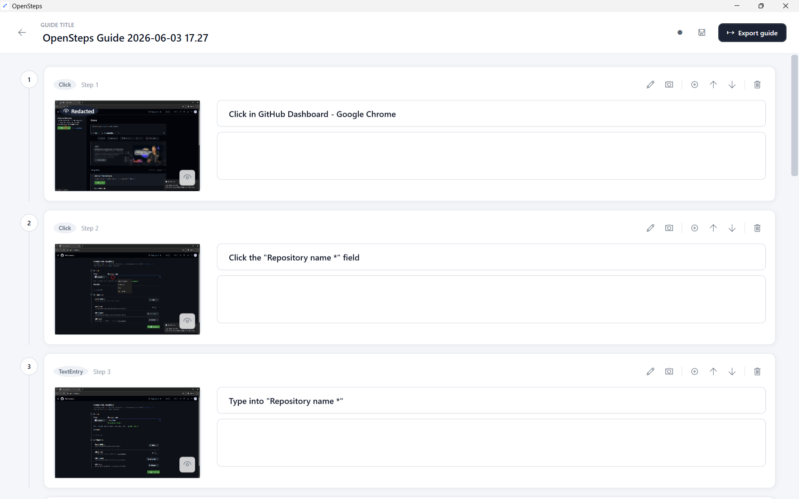

# OpenSteps

> [!WARNING]
> OpenSteps is an early Windows beta. It is usable for local workflow capture, but you should review every screenshot before sharing or exporting a guide.

<p align="center"><strong>A Windows-native recorder for turning desktop workflows into clean step-by-step guides.</strong></p>

OpenSteps records what you do on Windows, captures screenshots and click context, then turns the result into an editable guide you can export as Markdown or HTML. It is built for support docs, onboarding notes, internal SOPs, QA repro steps, and tutorials where you want a local tool instead of a cloud recorder.

<p align="center">
  
  <br />
  <em>OpenSteps before recording</em>
</p>

<p align="center">
  
  <br />
  <em>Editing a captured guide</em>
</p>

## What It Does

- Records desktop workflows with global click capture.
- Captures screenshots, click highlights, active-window metadata, and UI Automation context.
- Supports full-desktop screenshots or active-window-only screenshots.
- Skips OpenSteps UI, taskbar, and system-tray clicks so recordings stay focused on the real workflow.
- Saves recordings locally as editable sessions.
- Lets you rename guides, edit step titles and descriptions, reorder steps, delete steps, and insert manual steps.
- Lets you capture a screenshot for a manual step.
- Supports screenshot redaction and cropping before export.
- Collapses long step cards so larger recordings are easier to edit.
- Exports portable Markdown or HTML guides with relative image links.

## Why It Exists

Windows Steps Recorder was useful, but it is dated and limited. OpenSteps is a modern local-first replacement for people who need to document Windows workflows quickly without uploading screenshots, installing a browser extension, or using a SaaS account.

OpenSteps is especially useful for:

- IT support guides.
- Internal process documentation.
- QA reproduction steps.
- Customer support walkthroughs.
- Training and onboarding material.
- Personal notes for repeated desktop tasks.

## Export

OpenSteps exports a portable folder containing the guide file and ordered screenshots:

```text
Exported Guide/
guide.md
guide.html
images/
step-001.png
step-002.png
step-003.png
```

Markdown and HTML exports use relative links such as:

```markdown

```

The exported guide does not link back to `%LOCALAPPDATA%`, so you can move or share the export folder as a self-contained guide.

## Privacy

OpenSteps runs locally. It does not require an account, does not upload screenshots, and does not include telemetry.

Recordings are saved under:

```text
%LOCALAPPDATA%\OpenSteps\Sessions
```

Each saved session contains a `session.json` file and local screenshots. You can reopen, rename, edit, delete, and export sessions again.

Screenshot modes affect how much screen content is captured:

- **Full desktop** captures all visible monitors.
- **Active window only** captures the foreground window when possible.

If active-window capture fails, OpenSteps falls back to full-desktop capture so the step is not lost. Screenshots can still contain private data, so review every step before sharing a guide. Use crop and redaction to remove irrelevant or sensitive areas.

OpenSteps detects that typing happened, but it does not store typed characters by default. Safe keys such as `Enter`, `Tab`, and shortcuts like `Ctrl+S` may be recorded as documentation steps. Password and secure fields are treated cautiously.

## Build From Source

Requirements:

- Windows 10 or newer.
- .NET 8 SDK with Windows Desktop runtime.

Build and run:

```powershell
dotnet build OpenSteps.sln
dotnet run --project src\OpenSteps.App\OpenSteps.App.csproj
```

Run tests:

```powershell
dotnet test OpenSteps.sln
```

## Known Limits

- Elevated/admin apps may block hooks, screenshots, or metadata unless OpenSteps is also elevated.
- Some apps expose little or no UI Automation metadata; screenshots and click coordinates should still work.
- Active-window capture depends on Windows reporting usable window bounds.
- Full-screen apps and protected content may interfere with screenshot capture.
- Active-window capture may fall back to full-desktop capture when a window cannot be captured safely.
- The app is Windows-first and currently targets local desktop workflows only.

## Roadmap

- More reliable capture around unusual shell surfaces.
- Better generated titles from UI Automation metadata.
- More editor polish for long guides.
- Richer HTML export styling.

## Contributing

See [AGENTS.md](AGENTS.md) for repository guidelines. Keep changes focused, add tests for core behavior, and include manual verification notes for capture or WPF UI changes.

## License

MIT. See [LICENSE](LICENSE).
